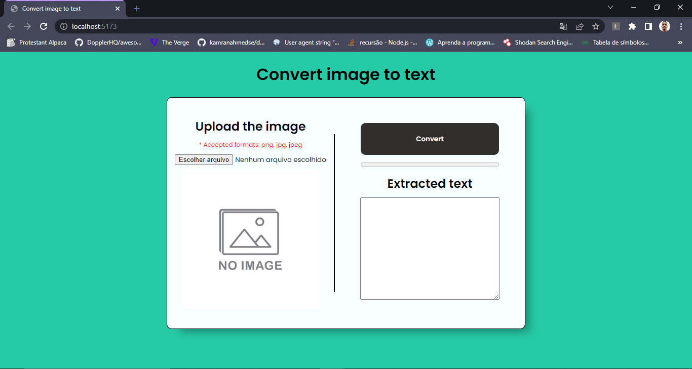
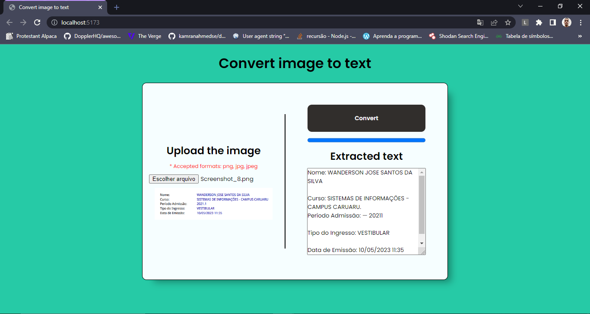

# Image Text Recognition using Tesseract.js

This is a simple project that demonstrates how to perform image text recognition using Tesseract.js. The project is built with Vite and React.

## Installation

To install the project dependencies, run the following command:

```
npm install
```

## Usage

To start the development server and launch the project in the browser, run the following command:
```
npm run dev
```

## About the Project

The project uses Tesseract.js to perform Optical Character Recognition (OCR) on images and extract text from them. The extracted text is then displayed on the screen.

The user can upload an image using the “Choose File” button and the OCR process will be automatically triggered. Once the text is extracted, it will be displayed on the screen.

## Screenshots





## Contributing

Contributions to this project are welcome! If you find a bug or would like to add a new feature, feel free to submit a pull request.

## License

This project is licensed under the MIT License. See the LICENSE file for more information.